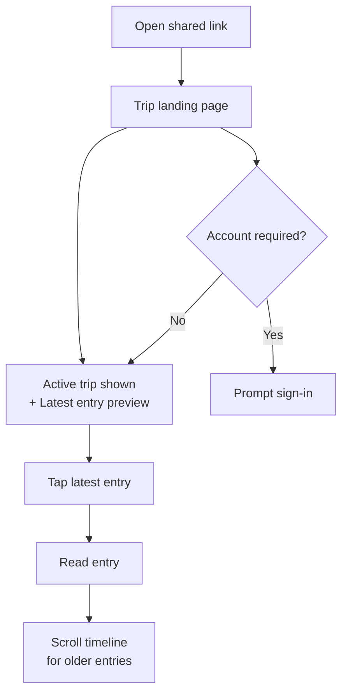
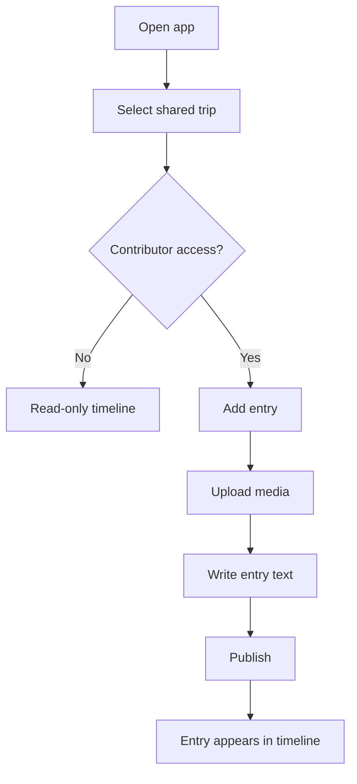

# UX Design Specification TravelBlogs

**Author:** Tommy
**Date:** 2025-12-21T14:17:35Z

---

<!-- UX design content will be appended sequentially through collaborative workflow steps -->

## Executive Summary

### Project Vision

TravelBlogs is a web-first, trip-centric storytelling app that organizes travel memories into a coherent map + timeline narrative. The experience prioritizes private, intentional sharing over public social feeds, with media-first daily entries that are easy to consume on a single page.

### Target Users

- Primary: solo travelers and couples who want structured, web-based trip journals and a clean way to share them with trusted people.
- Secondary: friends/family who follow along as viewers; trusted companions who can contribute entries when invited.

### Key Design Challenges

- Reduce friction for daily entry creation while supporting rich media.
- Keep trip context visible (map + timeline) without overwhelming first-time users.
- Balance private sharing with lightweight collaboration and clear roles.

### Design Opportunities

- A distinctive map + timeline “story mode” that makes trips feel like chapters.
- Media-first capture with auto-save and later editing to fit travel-day realities.
- A one-page viewer experience optimized for fast, immersive consumption.

## Core User Experience

### Defining Experience

The core loop is simple: users open the app to see new trip entries, select a trip, and read the latest blog entry. The product succeeds when this exploration feels fast, natural, and frictionless.

### Platform Strategy

TravelBlogs is a web-first application that must work smoothly on mobile browsers. Interaction should feel natural with mouse or touch, with minimal reliance on keyboard input. Offline support and device-specific capabilities are not required.

### Effortless Interactions

- Exploring trips and switching between them should feel immediate.
- Opening a blog entry and reading it should be simple and uninterrupted.
- Navigation should feel natural and predictable across desktop and mobile.

### Critical Success Moments

- The user feels “this is better” when navigation is simple and easy while exploring trips.
- The experience fails if navigation feels complicated or confusing, causing users to abandon the app.

### Experience Principles

- Make trip exploration and entry reading effortless.
- Prioritize natural, obvious navigation over feature density.
- Keep interactions fast and low-friction across devices.
- Reduce cognitive load during the read experience.

## Desired Emotional Response

### Primary Emotional Goals

- Feel the joy of traveling while reading.
- Experience the trip as if they are there.
- Feel inspired to plan their own trip.
- Feel confident and capable regardless of tech skill.

### Emotional Journey Mapping

- First discovery: intrigued and excited by the promise of “being there.”
- Core experience: immersed, joyful, and curious while exploring entries.
- After reading: inspired and motivated to travel or share the story.
- If something goes wrong: feel supported and not overwhelmed.
- Returning: feel welcomed and confident that it will be simple again.

### Micro-Emotions

- Confidence over confusion.
- Trust over skepticism.
- Excitement over anxiety.
- Accomplishment over frustration.
- Delight over plain satisfaction.
- Connection over isolation.

### Design Implications

- Use clear, low-friction navigation to preserve immersion.
- Keep interface simple and legible for non-technical users.
- Emphasize media-first storytelling to create “I’m there” feelings.
- Make recovery gentle when things go wrong to avoid frustration.

### Emotional Design Principles

- Evoke travel joy through immersive media and storytelling.
- Design for universal simplicity—no learning curve.
- Preserve a sense of presence and calm while browsing.
- Inspire action: “I want to go there too.”

## UX Pattern Analysis & Inspiration

### Inspiring Products Analysis

- Polarsteps: Strong at making trips feel impressive and story-like, with media that is easy to browse. Weakness: account-first onboarding creates friction.
- FindPenguins: Similar strengths in trip presentation and photo-first browsing. Weaknesses: account-first access and mobile-only experience limit sharing and reach.

### Transferable UX Patterns

- Media-first entry layouts that surface photos immediately to create “I’m there” immersion.
- Trip storytelling flow that makes browsing entries feel like a journey, not a feed.
- Simple, visually rich entry cards that invite exploration without cognitive load.

### Anti-Patterns to Avoid

- Forcing account creation before viewing a shared trip (hurts sharing and viewership).
- Mobile-only access that blocks casual viewers who prefer web browsing or no-install access.

### Design Inspiration Strategy

**What to Adopt:**
- Media-first storytelling layouts that make trips feel vivid and impressive.
- Simple, scannable entry browsing that highlights photos first.

**What to Adapt:**
- Trip narrative flow from mobile apps, optimized for web and larger screens.
- Sharing flows that allow viewing without sign-in for invited guests.

**What to Avoid:**
- Account-first onboarding for viewers.
- Mobile-only delivery that reduces accessibility and casual engagement.

## Design System Foundation

### 1.1 Design System Choice

Themeable design system as the foundation (e.g., MUI or Tailwind UI) to balance speed and customization.

### Rationale for Selection

- Solo developer with limited time needs fast, proven components.
- Web-first and responsive requirements fit well with established, themeable systems.
- Allows a distinct visual identity without building everything from scratch.
- Aligns well with Next.js implementation.

### Implementation Approach

- Start with a themeable component library to speed up layout and interaction building.
- Layer brand tokens (color, typography, spacing) to make the UI feel unique.
- Use library defaults for accessibility and responsiveness.

### Customization Strategy

- Customize top-level components: navigation, cards, entry layout, gallery.
- Keep base controls (buttons, inputs) close to the library defaults.
- Add a small set of custom components for the map/timeline storytelling feel.

## 2. Core User Experience

### 2.1 Defining Experience

Open the app and immediately see the active trip and the newest blog entries, then flow naturally into reading — with an effortless path to scroll back to the beginning of the trip.

### 2.2 User Mental Model

Users currently follow trips through a personal blog (e.g., Blogspot), but navigation is unclear and stories are hard to find. They expect a simple, obvious way to see the latest entry first and a clear path to earlier entries without digging through confusing menus.

### 2.3 Success Criteria

- Active trip is visible on launch.
- Newest entry is immediately accessible and readable.
- Users can smoothly scroll back to the start of the trip.
- Navigation feels clear and organized, not hidden or confusing.
- Experience feels fluid, even if not ultra-fast.

### 2.4 Novel UX Patterns

Use familiar patterns (trip card + latest entry preview + chronological timeline) to reduce learning curve. The unique twist is a map + timeline storytelling context that still keeps navigation obvious.

### 2.5 Experience Mechanics

**1. Initiation:**  
User opens the app and sees the active trip card plus a “Latest Entry” preview.

**2. Interaction:**  
Tap latest entry to read. Scroll to move backward through entries. Menu offers clearly labeled sections (All Trips, Timeline, Map, About).

**3. Feedback:**  
Entry title/date/location and media confirm they’re in the right place. The timeline position shows where they are in the trip.

**4. Completion:**  
User finishes the latest entry, can continue reading earlier entries, or switch trips via the clearly labeled menu.

## Visual Design Foundation

### Color System

Warm, human, travel-evocative palette with high readability.

- Primary: Warm Terracotta `#D46A4C`
- Secondary: Deep Teal `#1F6F78`
- Accent: Sunlit Sand `#F2E2C4`
- Surface: Warm Ivory `#FBF7F1`
- Text Primary: Charcoal `#2D2A26`
- Text Secondary: Warm Gray `#6B635B`
- Success: Olive Green `#4F7A4A`
- Warning: Amber `#D9A441`
- Error: Clay Red `#B34A3C`

Semantic mapping:
- Primary actions use Terracotta
- Links/secondary actions use Deep Teal
- Surfaces use Ivory with Sand highlights
- Text stays dark for contrast

### Typography System

Clean, modern sans-serif typography optimized for long-form entries.

- Headings: `Source Sans 3` (crisp, contemporary)
- Body: `Source Sans 3` (readable and consistent)
- Fallbacks: `"Segoe UI", "Calibri", "Arial", sans-serif`

Type scale (desktop):
- H1 36/44, H2 28/36, H3 22/30
- Body 18/30, Small 15/24

Mobile:
- Reduce by one step; keep body 17/28 for comfort.
- Line length target: 55-75 characters per line.

### Spacing & Layout Foundation

- Spacing base: 4px system.
- Layout: airy with clear section breathing room but not excessive.
- Max content width: 720-840px for reading comfort.
- Cards and panels use soft padding (16-24px) with clear separation.
- Grid: 12-column for desktop, 4-column for mobile; stack on small screens.

### Accessibility Considerations

- Maintain strong contrast for text on ivory backgrounds.
- Minimum body size 17-18px for readability.
- Focus states clear and visible for keyboard users.

## Design Direction Decision

### Design Directions Explored

Six directions were explored: Sunlit Journal (story-first), Atlas Path (map + timeline), Postcard Stack (card scan), Gallery Pulse (media grid), Timeline Drift (chronological flow), and Quiet Reader (minimal long-form).

### Chosen Direction

**Atlas Path** — a journey-aware layout that blends a map view with a clear timeline of entries.

### Design Rationale

- Matches the core experience: see the active trip and newest entries immediately.
- Uses familiar navigation patterns with a distinctive map + timeline twist.
- Keeps orientation obvious for all users, including less tech-savvy readers.
- Supports the “I’m there” emotional goal with spatial context.

### Implementation Approach

- Hero area shows active trip with map and latest entry preview.
- Timeline list stays prominent for easy back-scrolling.
- Navigation keeps “All Trips” and “Timeline” as top-level, clearly labeled sections.

## User Journey Flows

### 1) Creator: Create Trip + Post Daily Entry

**Goal:** Create a new trip and publish the first daily entry with media.

```mermaid
flowchart TD
  A[Open app] --> B{Signed in?}
  B -- No --> C[Sign in / create account]
  B -- Yes --> D[Trips dashboard]
  C --> D
  D --> E[Create new trip]
  E --> F[Enter trip details\n(title, dates, cover)]
  F --> G[Trip created]
  G --> H[Add new entry]
  H --> I[Upload media]
  I --> J[Write entry text]
  J --> K[Publish]
  K --> L[Entry appears at top\nof timeline]
  J --> M[Save draft]
  M --> L
```

### 2) Viewer: Open Shared Trip + Read Latest Entry

**Goal:** Open a shared link, see active trip, read the latest entry.



### 3) Contributor: Add Entry to Existing Trip

**Goal:** Add a new entry to a trip where contributor access is enabled.



### Journey Patterns

- **Navigation pattern:** Active trip card + latest entry preview as primary entry point.
- **Decision pattern:** Simple permission gating (viewer vs contributor).
- **Feedback pattern:** New entries appear at top of timeline with clear date/location labels.

### Flow Optimization Principles

- Latest entry is always visible on entry.
- Minimize steps for viewers (no account required).
- Keep entry creation simple: media → text → publish.
- Timeline remains the primary way to move backward through the trip.

## Component Strategy

### Design System Components

Leverage a themeable system (e.g., MUI or Tailwind UI) for core building blocks:

- Buttons, inputs, selects, toggles, chips, badges
- Cards, lists, tabs, breadcrumbs
- Modals, drawers, tooltips
- Grid, typography scale, icons, avatars

### Custom Components

### Active Trip Hero

**Purpose:** Show the active trip and newest entry immediately on open.  
**Usage:** Home/landing; top of trip view.  
**Anatomy:** Trip title, dates, map snapshot, latest entry preview CTA.  
**States:** Default, loading, empty (no entries).  
**Variants:** Compact (mobile), full (desktop).  
**Accessibility:** Map snapshot is decorative; CTA and title are focusable.  
**Content Guidelines:** Keep latest entry preview under 2 lines.  
**Interaction Behavior:** Tap preview opens latest entry.

### Timeline Entry Card

**Purpose:** Enable fast scanning and navigation through the trip.  
**Usage:** Timeline list and search results.  
**Anatomy:** Thumbnail/media strip, title, date, location, short summary.  
**States:** Default, hover, selected, unread/new.  
**Variants:** Compact (list), rich (media-heavy).  
**Accessibility:** Entire card is a link; ensure visible focus state.  
**Content Guidelines:** Summary capped at 120 chars.  
**Interaction Behavior:** Tap to open entry detail.

### Trip Switcher Panel

**Purpose:** Switch between trips without confusion.  
**Usage:** Global navigation.  
**Anatomy:** Trip list with cover thumb, dates, last updated.  
**States:** Default, selected, empty.  
**Variants:** Drawer (mobile), popover (desktop).  
**Accessibility:** Keyboard navigation through list items.  
**Interaction Behavior:** Selecting a trip returns to its latest entry.

### Entry Reader

**Purpose:** Long-form reading with immersive media.  
**Usage:** Entry detail view.  
**Anatomy:** Title, meta, media gallery, text body, map snippet.  
**States:** Default, loading, error.  
**Variants:** Read-only, contributor-editable.  
**Accessibility:** Type size 17-18px minimum; skip-to-content.  
**Interaction Behavior:** Scrollable story, sticky top bar for navigation.

### Map + Timeline Sync Panel

**Purpose:** Keep spatial context while browsing entries.  
**Usage:** Trip view.  
**Anatomy:** Map with pins + timeline list.  
**States:** Default, selected pin, no location data.  
**Variants:** Side-by-side (desktop), stacked (mobile).  
**Accessibility:** Keyboard pin navigation; map has list alternative.  
**Interaction Behavior:** Selecting pin highlights timeline entry.

### Share/Invite Panel

**Purpose:** Enable viewer access without friction.  
**Usage:** Trip settings/share.  
**Anatomy:** Share link, copy button, invite fields (optional).  
**States:** Default, copied, error.  
**Variants:** Minimal (link only), full (invite list).  
**Accessibility:** Clear labels and focus feedback.  
**Interaction Behavior:** Copy link shows success state.

### Component Implementation Strategy

- Build custom components on top of design system tokens.
- Keep core controls consistent with system defaults.
- Prioritize accessibility (focus states, keyboard navigation).
- Use shared layout primitives for spacing consistency.

### Implementation Roadmap

**Phase 1 (Core Journeys):**
- Active Trip Hero
- Timeline Entry Card
- Entry Reader

**Phase 2 (Navigation + Context):**
- Trip Switcher Panel
- Map + Timeline Sync Panel

**Phase 3 (Sharing):**
- Share/Invite Panel

## UX Consistency Patterns

### Button Hierarchy

**When to Use:** Primary for the single most important action; secondary for supportive actions; destructive only when necessary.  
**Visual Design:**  
- Primary: Teal filled buttons  
- Secondary: Ghost style (text + subtle hover)  
- Destructive: Clay red with clear label  
**Behavior:**  
- Only one primary action per view  
- Destructive actions require confirm modal  
**Accessibility:** Clear focus states and minimum 44px touch targets  
**Mobile Considerations:** Primary action anchored near thumb-reach when possible

### Form Patterns

**When to Use:** Trip creation, entry creation/editing, sharing.  
**Visual Design:** Labels above fields with asterisk for required fields.  
**Behavior:**  
- Inline validation as users type  
- Errors appear below field with gentle, human language  
- Submit disabled until required fields are valid  
**Accessibility:**  
- Associate labels/inputs  
- Error text announced by screen readers  
**Mobile Considerations:**  
- Large tap targets and clear spacing between inputs

### Navigation Patterns

**When to Use:** Global navigation, trip switching, entry browsing.  
**Visual Design:**  
- Desktop: Sidebar navigation with hamburger menu  
- Mobile: Bottom button bar for primary sections  
**Behavior:**  
- Latest entry is visible on entry, but no persistent CTA  
- Trips are always accessible via the nav  
**Accessibility:**  
- Keyboard support for sidebar menu  
- Clear active state indicator  
**Mobile Considerations:**  
- Bottom bar stays visible during scrolling

## Responsive Design & Accessibility

### Responsive Strategy

- **Desktop:** Map + timeline side-by-side for maximum context.
- **Tablet:** Stacked layout (map above timeline) to keep reading simple.
- **Mobile:** Stacked layout with bottom navigation for primary sections.

### Breakpoint Strategy

- **Mobile:** <768px  
- **Tablet:** 768-1023px  
- **Desktop:** 1024px+

Mobile-first layout with progressive enhancement for larger screens.

### Accessibility Strategy

- Target **WCAG AA** compliance.
- Ensure 4.5:1 contrast for body text.
- Visible focus states for all interactive elements.
- Minimum 44x44px touch targets.

### Testing Strategy

- Basic accessibility testing: keyboard navigation, focus visibility, contrast checks.
- Responsive device checks across mobile/tablet/desktop in major browsers.

### Implementation Guidelines

- Use semantic HTML and ARIA labels where necessary.
- Support keyboard navigation for menus and drawers.
- Keep line lengths and spacing optimized for readability.
- Avoid hover-only interactions; ensure touch parity.
